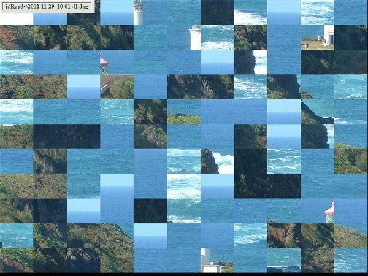



## Puzzle

### Description

New ScreenShot (Sep 13, 2007)

It's a Puzzle. Try to put the pieces in their correct positions.

Puzzle is a very easy game to play. Start Puzzle, then migrate to a Folder that contains Image files. You may select any picture you like. You may use the same picture over or select a new one each time. If you like, I will select one of the Graphic files at random. I will give you a few seconds to study the picture before I scramble it. Then all you have to do is to click on any two puzzle pieces, and press the 'Enter' key. When you press 'Enter', the last two puzzle pieces that you clicked will trade places. Keep swapping pieces until the Puzzle is solved. The first puzzle has only four large pieces and should be quite easy, but they get progressively more difficult. Like any Puzzle, some are easier and some are more difficult than others.

Right click once anywhere on the Puzzle to open the Popup Menu.

(Sep 10, 2007) - Added the "adesktop.tlb" that was missing from the first submission.
 
### More Info
 
Right click once anywhere on the Puzzle to open the Popup Menu.

PSC Moderator: The "Old" ScreenShot was not very effective, so I replaced it with this one. No need to update the Ticker if you don't want. Thank you!

Randy Giese

             |
---                |---
**Submitted On**   |2007-09-09 20:07:46
**By**             |[Randy Giese](https://github.com/Planet-Source-Code/PSCIndex/blob/master/ByAuthor/randy-giese.md)
**Level**          |Intermediate
**User Rating**    |5.0 (10 globes from 2 users)
**Compatibility**  |VB 6\.0
**Category**       |[Games](https://github.com/Planet-Source-Code/PSCIndex/blob/master/ByCategory/games__1-38.md)
**World**          |[Visual Basic](https://github.com/Planet-Source-Code/PSCIndex/blob/master/ByWorld/visual-basic.md)
**Archive File**   |[Puzzle2082789102007\.Zip](https://github.com/Planet-Source-Code/randy-giese-puzzle__1-69299/archive/master.zip)

